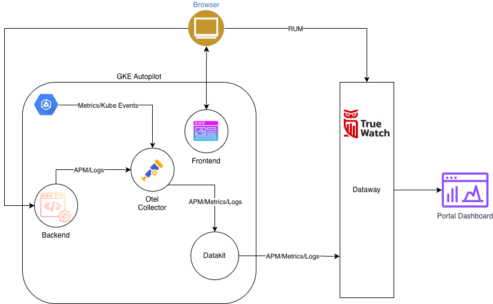

# GKE Autopilot Cluster intergration Truewatch

The system uses the Otel Collector to gather metrics, events, APM, and logs, then passes them through Datakit and Dataway to be visualized on the TrueWatch dashboard.

## Architecture

- Data Collection: At the core of the system, the Otel Collector is responsible for gathering data. It collects Kubernetes metrics and events from the cluster, as well as APM (Application Performance Monitoring) data and logs from the backend services.

- Data Transmission: Once collected, all this telemetry data is sent to Datakit. From there, Datakit uploads the information to the Dataway gateway.

- Visualization: Finally, the data is processed and presented in the TrueWatch Portal Dashboard, allowing you to monitor the entire system in one place.

⚠️ Important: The metrics set generated by OpenTelemetry (via kube-state-metrics & otel-service) differs from the metrics used by the default dashboard. Therefore, we must manually configure a new dashboard to align with the actual data.

Refrence:

- [kube-state-metrics](https://github.com/kubernetes/kube-state-metrics/blob/main/docs/README.md)
- [otel-service](https://github.com/open-telemetry/opentelemetry-collector-contrib)
